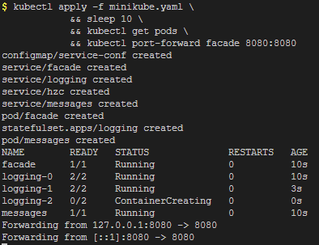
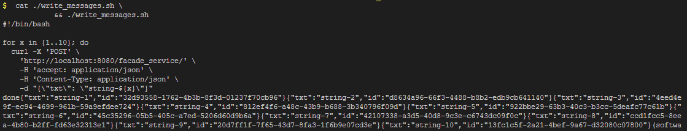
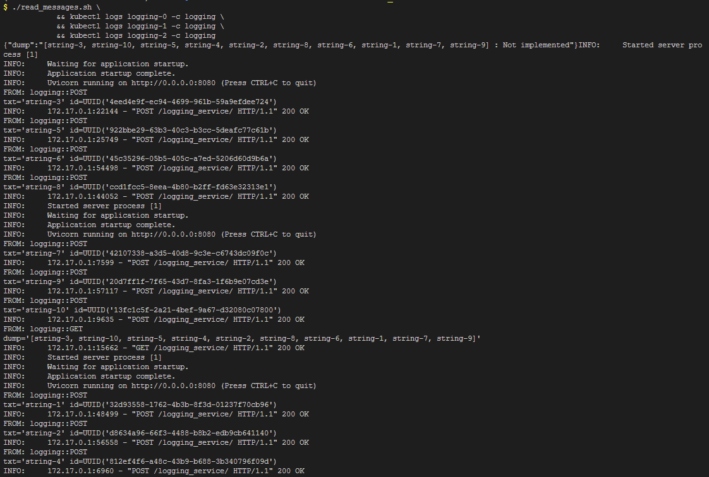
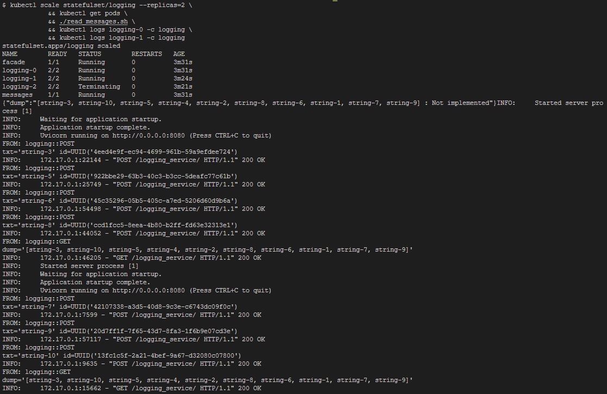
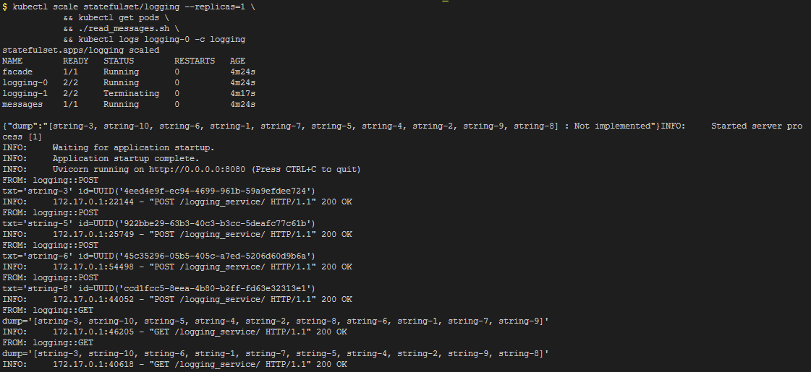
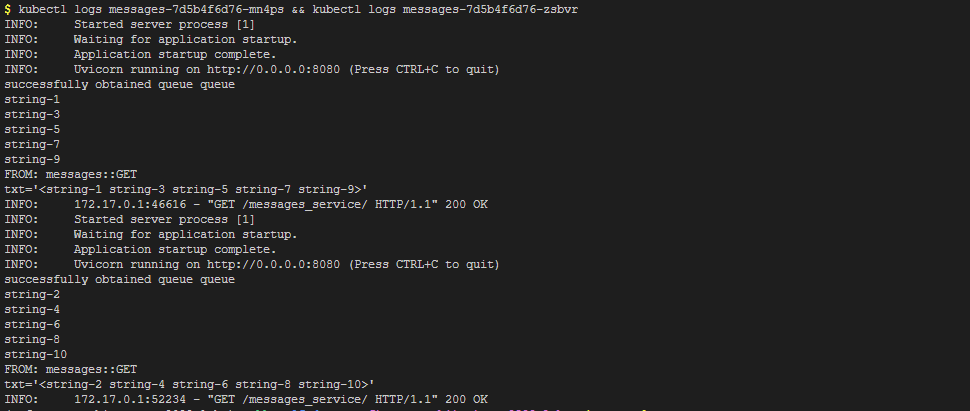

# software-architecture-2022-labs

> Protocol

### Lab III: Micro_Hazelcast
- Author: [Maksym Bilyk](https://github.com/mak9su4roi)

---

### Set-up
```bash
git clone https://github.com/mak9su4roi/software-architecture-2022-labs.git
```
```bash
cd software-architecture-2022-labs
```
```bash
git checkout micro_hazelcast
```

---

### Run

- Part I:
    - Launch a cluster
        ```bash
        kubectl apply -f minikube.yaml \
            && sleep 10 \
            && kubectl get pods \
            && kubectl port-forward facade 8080:8080
        ```
        

- Part II:
    - Send 10 messages
        ```bash
        cat ./write_messages.sh \
            && ./write_messages.sh
        ```
        

- Part III
    - Read from 3 hazelcast nodes
        ```bash
        ./read_messages.sh \
            && kubectl logs logging-0 -c logging \
            && kubectl logs logging-1 -c logging \
            && kubectl logs logging-2 -c logging
        ```
        
 
    - Read from 2 hazelcast nodes
        ```bash
        kubectl scale statefulset/logging --replicas=2 \
            && kubectl get pods \
            && ./read_messages.sh \
            && kubectl logs logging-0 -c logging \
            && kubectl logs logging-1 -c logging
        ```
        

    - Read from 1 hazelcast node
        ```bash
        kubectl scale statefulset/logging --replicas=1 \
            && kubectl get pods \
            && ./read_messages.sh \
            && kubectl logs logging-0 -c logging
        ```
        

- Part IV:
    - Stop cluster
        ```bash
        kubectl delete -f minikube.yaml \
            && kubectl get pods
        ```
        

