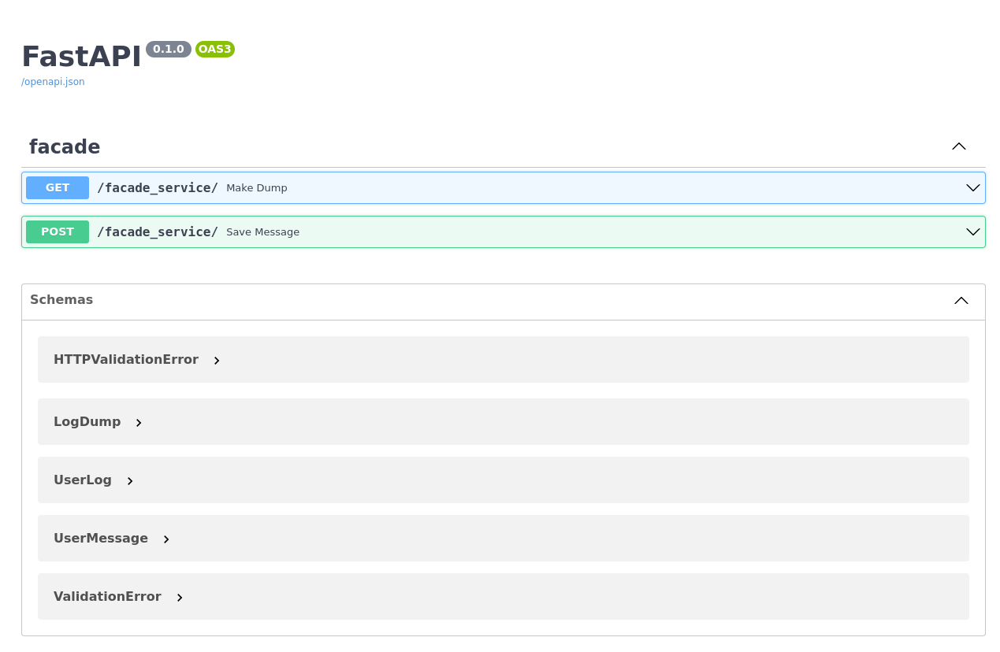
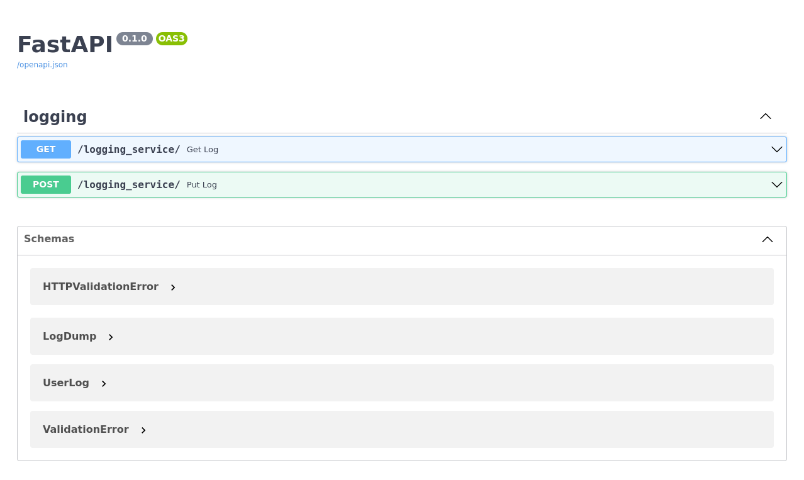
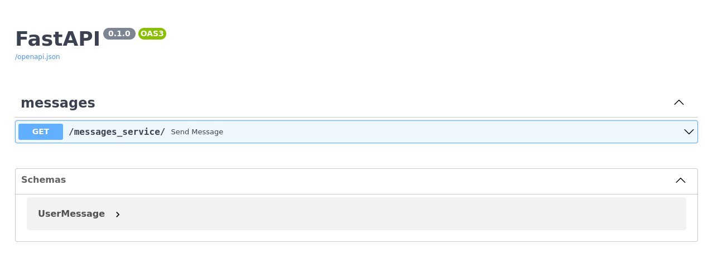
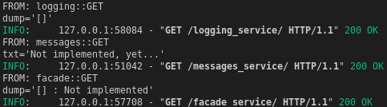
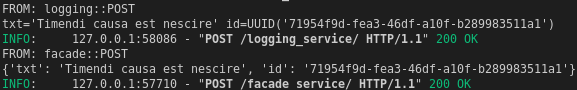
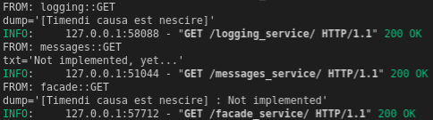
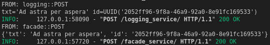
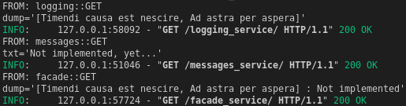
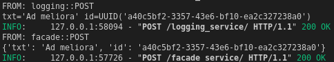
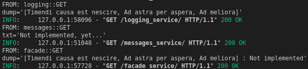

# software-architecture-2022-labs

> Protocol

### Lab I: Basic Architecture 
- Author: [Maksym Bilyk](https://github.com/mak9su4roi)

---

### Set-up
```bash
git clone https://github.com/mak9su4roi/software-architecture-2022-labs.git
```
```bash
cd software-architecture-2022-labs
```
```bash
git checkout micro_basics 
```
```bash
pipenv install
```
```bash
pipenv shell
```
```bash
chmod +x app.py
```
---

### Run
```bash
./app.py
```

---

# Interface

## facade_service

## logging_service

## messages_service


---

# Demo
1. GET
    - Action:
        ```bash
            curl -X 'GET' \
                'http://localhost:8000/facade_service/' \
                -H 'accept: application/json'
        ```
    - Result:
        
2. POST
    - Action:
        ```bash
            curl -X 'POST' \
                'http://localhost:8000/facade_service/' \
                -H 'accept: application/json' \
                -H 'Content-Type: application/json' \
                -d '{
                "txt": "Timendi causa est nescire"
                }'
        ```
    - Result:
        
3. GET
    - Action:
        ```bash
            curl -X 'GET' \
                'http://localhost:8000/facade_service/' \
                -H 'accept: application/json'
        ```
    - Result:
        
4. POST
    - Action:
        ```bash
            curl -X 'POST' \
                'http://localhost:8000/facade_service/' \
                -H 'accept: application/json' \
                -H 'Content-Type: application/json' \
                -d '{
                "txt": "Ad astra per aspera"
                }'
        ```
    - Result:
        
5. GET
    - Action:
        ```bash
            curl -X 'GET' \
                'http://localhost:8000/facade_service/' \
                -H 'accept: application/json'
        ```
    - Result:
        
6. POST
    - Action:
        ```bash
            curl -X 'POST' \
                'http://localhost:8000/facade_service/' \
                -H 'accept: application/json' \
                -H 'Content-Type: application/json' \
                -d '{
                "txt": "Ad meliora"
                }'
        ```
    - Result:
        
7. GET
    - Action:
        ```bash
            curl -X 'GET' \
                'http://localhost:8000/facade_service/' \
                -H 'accept: application/json'
        ```
    - Result:
        
