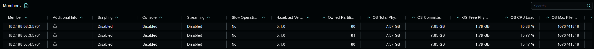
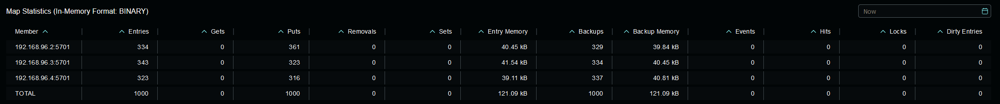
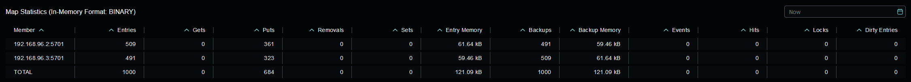
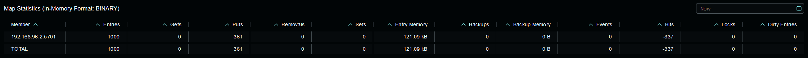
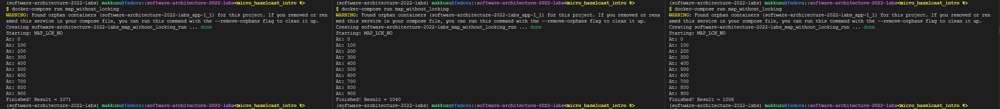
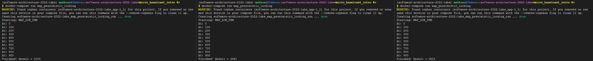
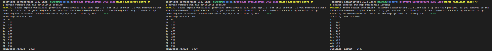
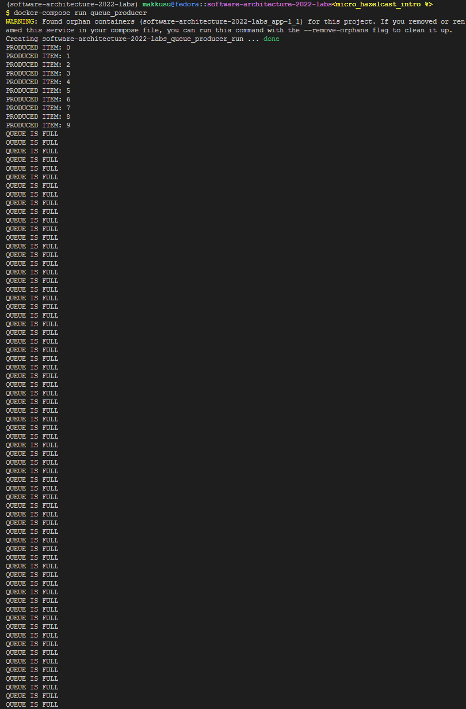
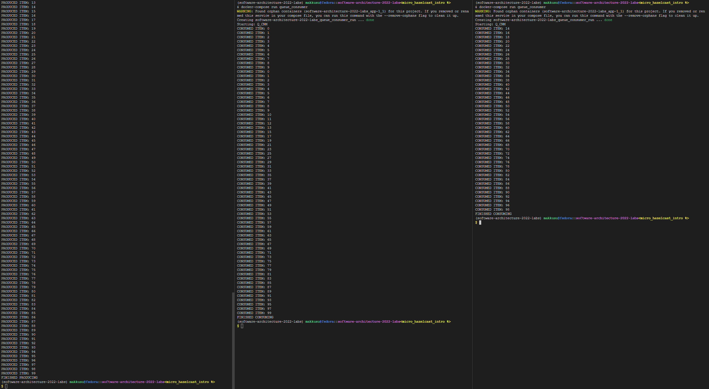

# software-architecture-2022-labs

> Protocol

### Lab II: Hazelcast intro
- Author: [Maksym Bilyk](https://github.com/mak9su4roi)

---

### Set-up
```bash
git clone https://github.com/mak9su4roi/software-architecture-2022-labs.git
```
```bash
cd software-architecture-2022-labs
```
```bash
git checkout micro_hazelcast_intro
```

---

### Run

- Part II:
    - Launch a cluster
        ```bash
        docker-compose up hz_mc
        ```
        

- Part III:
    - Value distribution among 3 nodes
        ```bash
        docker-compose run clear_map
        docker-compose run fill_map
        ```
        

    - Value distribution among 2 nodes
        ```bash
        docker-compose stop hz_001
        ```
        
    
    - No data loss so far :)
        ```bash
        docker-compose stop hz_002
        ```
        

- Part IV:
    - Without Locking: dataraces occur
        ```bash
        docker-compose run clear_map
        docker-compose run map_without_locking
        ```
        

    - With pessimistic Locking: no dataraces occur
        ```bash
        docker-compose run clear_map
        docker-compose map_pessimistic_locking
        ```
        

    - With optimistic Locking: no dataraces occur
        ```bash
        docker-compose run clear_map
        docker-compose run map_optimistic_locking
        ```
        

- Part V:
    - When queue is full producer is waiting to put its items
        ```bash
        docker-compose run clear_queue
        docker-compose run queue_producer
        ```
        
        

    - When all consumers finished their tasks there should be only one terminating item
        ```bash
        docker-compose run queue_consumer
        ```
        
        
